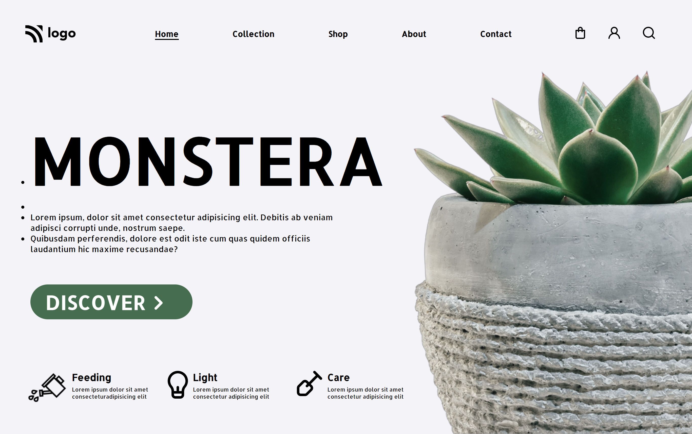

# Plant nursery page [](http://www.gnu.org/licenses/agpl-3.0)

- This template is purely made in HTML and CSS. website is regarding plant nursery store and how to manage it.

- I make this site little responsive.

## 🛠 Technologies Used

- HTML5 - Hyper Text Markup Language
- CSS3 - Cascading Spread Sheet

## Demo




## Run Locally

Clone the project

```bash
  git clone https://github.com/rakshitkoyani/Plant-Nursery.git
```

Go to the project directory

```bash
  cd Plant-Nursery
```

## Author

- [Rakshit Koyani](https://www.github.com/rakshitkoyani)
  - [](https://www.linkedin.com/in/rakshit-koyani-507040132/)
  - [](https://www.instagram.com/rakshitkoyani/)
  - [](https://www.twitter.com/rakshit_koyani)

## What I have learnt in this project

1. I revised flexbox implementation along with making responsive design.
2. I learn and applied media query for image and big font size.

## Honest Time to finish the project

It takes me around 3.5 hours to complete me this project.

## Live link of the project

https://rakshitkoyani.github.io/Plant-Nursery/
